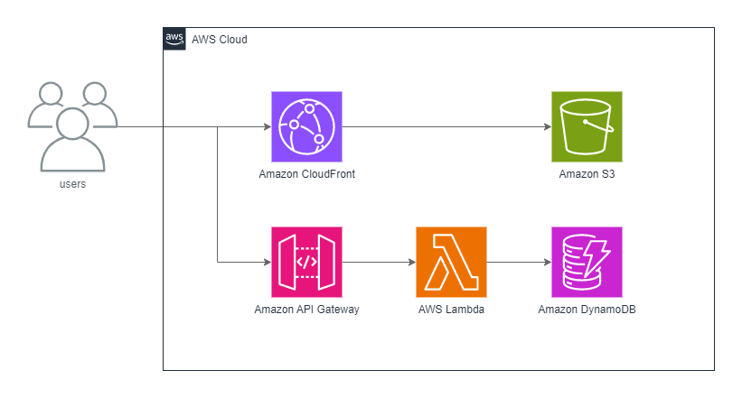

# kanji-sum

漢字の画数の総和をもとめるアプリ

使用したデータは以下  
MJ文字情報一覧表 Ver.006.01  
[MJ文字情報一覧表](https://moji.or.jp/mojikiban/mjlist/)

ライセンス  
[クリエイティブ・コモンズ 表示 – 継承 2.1 日本 ライセンス](https://creativecommons.org/licenses/by-sa/2.1/jp/)
